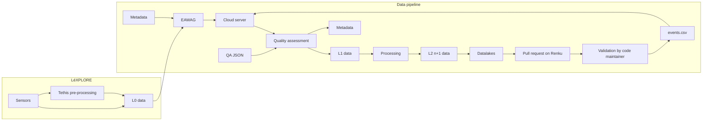
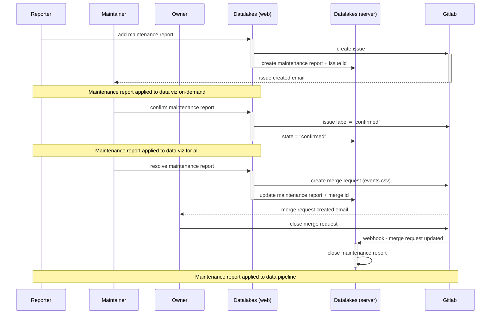

# Overview of the quality assurance and quality control (QA/QC) pipeline

## QA/QC in FLAKE - overview

## Submission of a maintenance report - Sequence diagram

The following diagram describes the flow of a submission by a user on Datalakes, the QA/QC process by the data curator and/or advisor, and their relation to the web and server aspects of Datalakes as well as the instrument repository.

