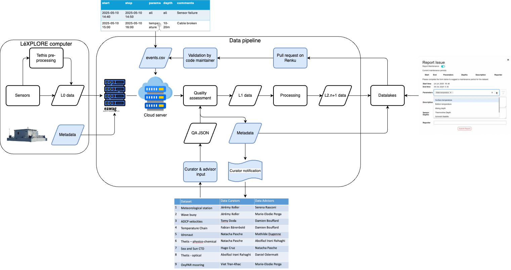
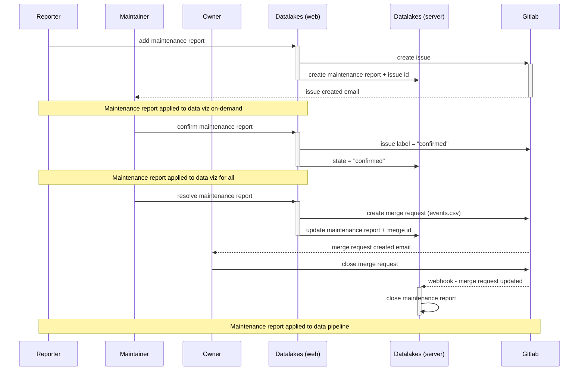

# Overview of the quality assurance and quality control (QA/QC) pipeline

## QA/QC in FLAKE - overview

## From issue reporting to data curation

### Steps

The QA/QC procedure is divided into the following four steps:

1. **Issue report**: A reporter (i.e., any datalakes user, including the data curator and advisor) detects an QC issue, fills and submits the ["Report Issue" form](guides/reporting.md). The issue is added to the list of issues in the issue form on Datalakes and in the git repository of the dataset. A notification is sent to the data curator/advisor if they have turned on the notifications for the dataset repository on renku. The data is still visible on Datalakes to the users (not masked yet), but a colored box is displayed around the flagged data by clicking on "Show Masked Points" in the Display Options. Information about the issue can be found by moving the mouse on this box. At this stage, the reporter can still edit the issue.
2. **Issue review**: the data curator/advisor [reviews](guides/management.md) the reported issue. If the issue has been reported by the data curator, the data advisor reviews it (and vice-versa). They check if the issue is valid and can either edit, confirm or delete it. Once the issue is confirmed, the data is masked on Datalakes but remains present in the database (i.e., not masked in Level 2 files). 
3. **Issue validation**: once an issue is confirmed and masked on Datalakes, the data curator/advisor can either [resolve](guides/management.md)  it, edit it by going back to the non-confirmed issue or delete it. They resolve the issue only if they are satisfied with the masking. Resolving the issue creates a merge request in the instrument repository to permanently mask the data in the datafiles (Level 2). 
4. **Data reprocessing**: the merge request is accepted and merged in the instrument repository. The events.csv is updated, the data is reprocessed and the issue-related data is permanently masked in the Level 2 files.

### States
Issue states are displayed in the "Report Issue" form (for authenticated users only). The issue can have four different states based on the steps above:

- **Reported**: the issue has been created by the reporter but not reviewed by the data curator/advisor yet. 
- **Confirmed**: the issue has been reviewed and confirmed by the data curator/advisor. 
- **Resolved**: the issue has been validated by the data curator/advisor and a merge request has been created in the instrument repository.
- **Closed**: the issue has been closed after the merge request has been accepted and merged in the instrument repository. 

### Sequence diagram

The following diagram describes the flow of a submission by a user on Datalakes, the QA/QC process by the data curator and/or advisor, and their relation to the web and server aspects of Datalakes as well as the instrument repository.

