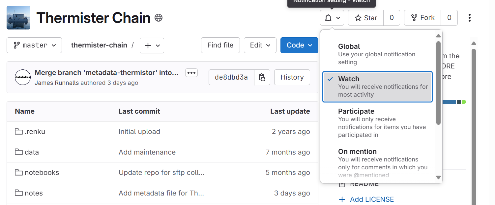
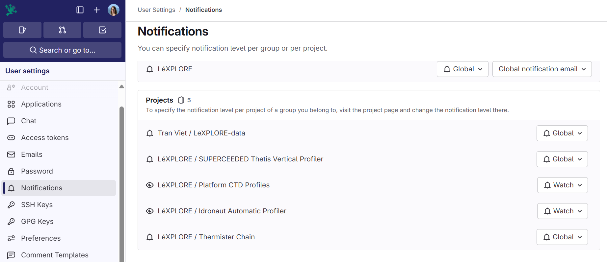

# Assigning a data curator/advisor to a dataset (tentative)

To assign a data curator to a dataset in the development version of Datalakes, the following steps must be followed:

- give a `dev` or `maintainer` role to the data curator in the repository
- if no issue template exists, create an issue template
- specify the data curator's user-name in the quick-action at the end of the issue template:

```
/assign @data-curator-username @data-advisor-username
```

where `@data-curator-username` is the GitLab username of the data curator you want to assign, and `@data-advisor-username` is the GitLab username of the data advisor.

## Set up your email notification
Open your assign dataset, then open the dedicated Git repository
In the Git repository, select the "bell" and select "Watch", as below



You can check that the notification works, under your profile > preferences > notifications. At the bottom, you should see:

