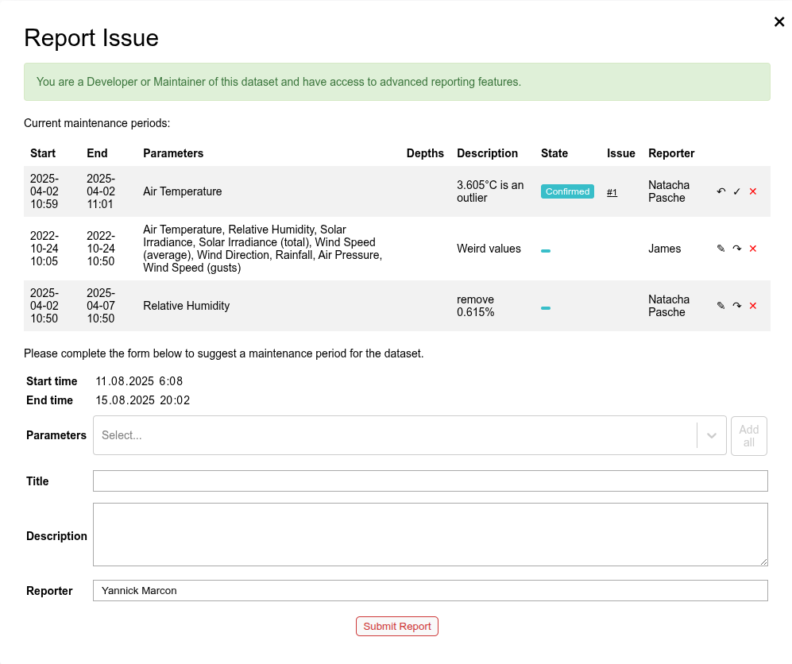

# Managing a reported issue in Datalakes

<!-- prettier-ignore-start -->

!!! warning
    The confirmation and validation of issues can only be done in the development version of Datalakes: [https://datalakes.epfl.ch/](https://datalakes.epfl.ch/)

<!-- prettier-ignore-end -->

When an issue is reported, the data curator should be [automatically assigned](assignment.md) to the issue in GitLab. Upon notification, the data curator should manage the issue directly on Datalakes, using the issue management popup

## Overview of the issue management popup

If the data curator is logged in with their Renku credentials and has the appropriate role in the repository, the "Report Issue" button will open a more detailed issue management popup. This popup allows the data curator to:

- Edit the issue (pencil icon)
- Confirm the issue (left-to-right arrow icon)
- Unconfirm the issue (right-to-left arrow icon)
- Validate the issue (checkmark icon)

## Confirming the issue on Datalakes

The first step of the process for the data curator is to confirm that the issue is valid. As long as the issue has not been confirmed, the data remains visible to the users and the data curator has the oppourtunity to edit the issue if needed. Once the data curator is satisfied that the issue is valid, they can confirm the issue. This will mask the data in Datalakes, meaning that it will no longer be visible to the users. The confirmation can be removed to unmask the data and edit the issue if needed.

## Validating the issue on Datalakes

Once the issue is confirmed, the next step is to validate that removing the data has produced the desired effect. If the data curator is satisfied with the masking, they can validate the issue. This will trigger [a merge request](merging.md) in the instrument repository to update the events.csv file and permanently remove the data from Datalakes.
