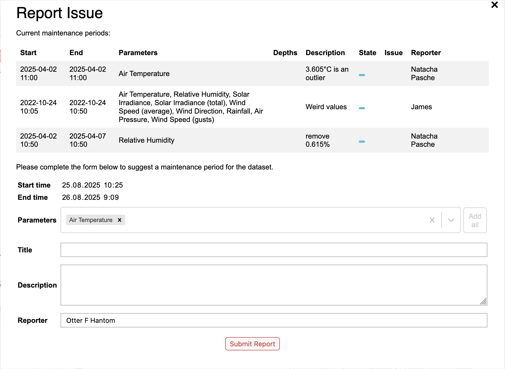

# Reporting an issue

To report an issue you encountered in a LéXPLORE dataset in the development version of datalakes, follow these steps below. In the following, we assume that the user has logged into the development version of Datalakes with their Renku credentials and therefore has access to the detailed issue submission form

<!-- prettier-ignore-start -->

!!! warning
    If you logged in with your GitHub or GitLab account, you will only have access to the simplified form.

<!-- prettier-ignore-end -->

1. Activate the brush mode (Ctrl + click) and select the area of interest in the dataset
2. Click on the "Report Issue" button below the dataset view, on the right side.
   
3. Complete the issue submission form with the relevant details about the issue you encountered.
    1. Provide a clear and concise title for your issue.
    2. Describe the issue in detail.
    3. Specify the parameters affected by the issue.

<!-- prettier-ignore-start -->

<!-- prettier-ignore-end -->
