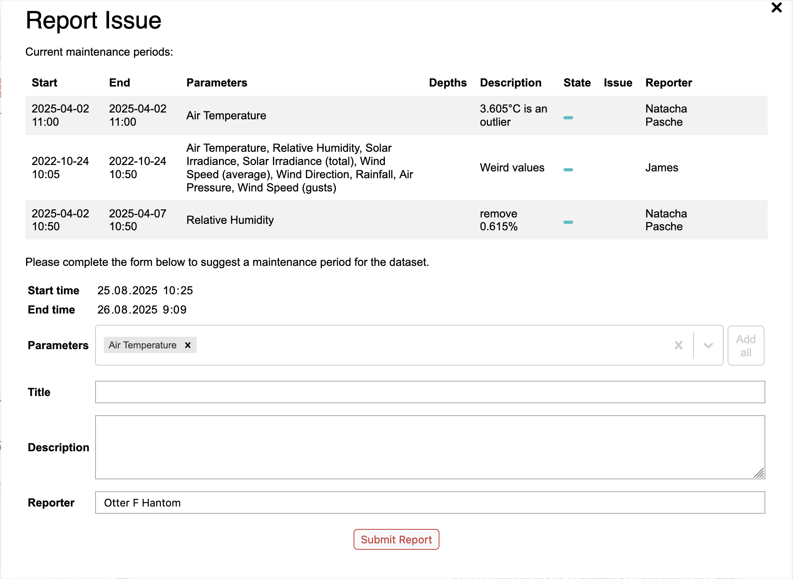

# Reporting a quality-control issue

To report an issue you encountered in a LéXPLORE dataset in datalakes, follow these steps below. In the following, we assume that the user has logged into Datalakes with their credentials and therefore has access to the detailed issue submission form

1. Activate the brush mode (Ctrl + click) and select the area of interest in the dataset
2. Click on the "Report Issue" button below the dataset view, on the right side.
   
3. Complete the issue submission form with the relevant details about the issue you encountered.
    1. Provide a clear and concise title for your issue.
    2. Describe the issue in detail.
    3. Specify the parameters affected by the issue.
    4. Submit the report.
4. Check that the issue has been correctly reported. A colored box is displayed around the flagged data by clicking on "Show Masked Points" in the Display Options. Information about the issue can be found by moving the mouse on this box. Edit the issue if needed.
